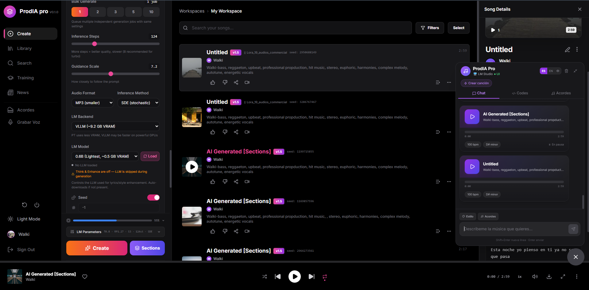

<h1 align="center">🎛️ ProdIA-MAX</h1>

<p align="center">
  <strong>Enhanced fork of ACE-Step UI — AI Music Production Suite for Windows</strong><br>
  <em>Fork mejorado de ACE-Step UI — Suite de producción musical con IA para Windows</em>
</p>

<p align="center">
  
  
  
  
</p>

<p align="center">
  
</p>

---

## 🙏 Credits / Créditos

> **ProdIA-MAX is a fork and extension of [ACE-Step UI](https://github.com/fspecii/ace-step-ui) by [fspecii](https://github.com/fspecii).**  
> All original UI code, architecture, and design belong to their respective authors.  
> This project adds Windows-specific tooling and production-focused enhancements on top of their work.

> **ProdIA-MAX es un fork y extensión de [ACE-Step UI](https://github.com/fspecii/ace-step-ui) creado por [fspecii](https://github.com/fspecii).**  
> Todo el código UI original, arquitectura y diseño pertenecen a sus respectivos autores.  
> Este proyecto añade herramientas optimizadas para Windows y mejoras orientadas a producción musical.

| Component | Author | License | Link |
|-----------|--------|---------|------|
| **ACE-Step UI** (base UI) | [fspecii](https://github.com/fspecii) | MIT | [github.com/fspecii/ace-step-ui](https://github.com/fspecii/ace-step-ui) |
| **ACE-Step 1.5** (AI model) | [ACE-Step Team](https://github.com/ace-step) | MIT | [github.com/ace-step/ACE-Step-1.5](https://github.com/ace-step/ACE-Step-1.5) |
| **ProdIA-MAX** (this fork) | [ElWalki](https://github.com/ElWalki) | MIT | — |

---

## 🚀 What is ProdIA-MAX? / ¿Qué es ProdIA-MAX?

**EN:** ProdIA-MAX is a Windows-optimized fork of ACE-Step UI that bundles extra production tools: BPM/key detection, automatic lyric transcription, vocal/instrumental separation, LoRA training preparation, and one-click launchers — all wired to the ACE-Step 1.5 AI music generation engine.

**ES:** ProdIA-MAX es un fork de ACE-Step UI optimizado para Windows que incluye herramientas extra de producción: detección de BPM y tonalidad, transcripción automática de letras, separación vocal/instrumental, preparación para entrenamiento LoRA y lanzadores con un solo clic — todo integrado con el motor de generación musical IA ACE-Step 1.5.

---

## ✨ MAX Additions / Añadidos MAX

### 🎵 Generation & Audio
| Feature | Status | Description |
|---------|--------|-------------|
| **Vocal Separation (Demucs)** | ✅ Beta | Separate vocals/instrumental from any song |
| **Vocal Reference Tab** | ✅ | Dedicated vocal reference panel |
| **Independent Audio Strengths** | ✅ | Separate reference + source strength sliders |
| **Audio Codes System** | ✅ | Full semantic audio code pipeline — extract, apply & condition generation |
| **Mic Recorder + Audio Codes** | ✅ | Record voice → auto-extract Audio Codes + optional Whisper transcription |
| **Whisper Model Selector** | ✅ | Choose Whisper model (tiny→turbo) with download status indicators |
| **Process + Whisper / Solo Procesar** | ✅ | Two-button workflow: extract codes with or without lyric transcription |
| **Chord Progression Editor** | ✅ | Interactive chord builder with scale-aware suggestions and audio preview |
| **1/4 Time Signature** | ✅ | Added 1/4 time signature option to all time signature selectors |

### 🤖 AI Assistant & UX
| Feature | Status | Description |
|---------|--------|-------------|
| **Chat Assistant** | ✅ | Built-in AI assistant (OpenRouter/local LLM) for music production guidance |
| **LLM Provider Selector** | ✅ | Switch between OpenRouter models or local LLM endpoints |
| **Language Selector** | ✅ | Full i18n — switch UI language (ES/EN/+more) |
| **Sidebar Info Panel** | ✅ | Click info icons → scrollable info panel in sidebar (no clipping) |
| **Professional Audio Player** | ✅ | Enhanced player with playback speed, shuffle, repeat modes |
| **Song Cards & Drag-Drop** | ✅ | Visual song cards with drag-and-drop to playlists |
| **Resizable Chat Panel** | ✅ | Drag to resize chat assistant panel |
| **Style Editor** | ✅ | Edit and manage generation style presets |

### 🔧 Production Tools
| Feature | Status | Description |
|---------|--------|-------------|
| **Audio Metadata Tagging** | ✅ | ID3 tags (title, artist, BPM, key) in MP3s |
| **Edit Metadata** | ✅ | Edit BPM, key, time signature, title in-app |
| **LoRA Quick Unload** | ✅ | One-click unload on collapsed LoRA panel |
| **Time Signature Labels** | ✅ | Proper 1/4, 2/4, 3/4, 4/4, 5/4, 6/8, 7/8, 8/8 notation |
| **Prepare for Training** | ✅ Beta | Quick button to prep songs for LoRA training |
| **VRAM Safety** | ✅ | Generation locked during Demucs separation |
| **BPM & Key Detection** | ✅ | `detectar_bpm_clave.py` — batch detect BPM/key |
| **Lyric Transcription** | ✅ | `transcribir_letras.py` — Whisper-based transcription |
| **Caption Tools** | ✅ | Apply/truncate training captions automatically |
| **One-click Windows launchers** | ✅ | `.bat` scripts for setup, launch, and cleanup |

---

## 🏆 Best Quality Settings / Mejores Ajustes de Calidad

> **IMPORTANT / IMPORTANTE:** Audio generation quality is **dramatically better** using the **base model at 124 inference steps** compared to turbo mode (8 steps). While turbo is faster (~3-5s per song), the base model at 124 steps produces significantly richer, more coherent, and higher-fidelity audio.
>
> **La calidad de generación de audio es MUCHÍSIMO mejor usando el modelo base a 124 pasos** en comparación con el modo turbo (8 pasos). Aunque turbo es más rápido (~3-5s por canción), el modelo base a 124 pasos produce audio significativamente más rico, más coherente y de mayor fidelidad.

| Setting | Turbo (fast) | **Base (recommended)** |
|---------|-------------|----------------------|
| Model | `turbo` | **`base`** |
| Inference Steps | 8 | **124** |
| Speed (30s song) | ~3-5s | ~45-90s |
| Quality | Good | **Excellent** ⭐ |
| Coherence | Decent | **Very high** |
| Recommended for | Quick previews | **Final production** |

---

## 📋 Requirements / Requisitos

| Requirement | Minimum | Recommended |
|-------------|---------|-------------|
| OS | Windows 10 | Windows 11 |
| GPU VRAM | 4 GB | 12 GB+ |
| Python | 3.10 | 3.11 |
| Node.js | 18 | 20 |
| CUDA | — | 12.8 |

---

## ⚡ Quick Start / Inicio rápido (Windows)

```bat
REM 1. Setup (only first time / solo la primera vez)
setup.bat

REM 2. Launch everything / Lanzar todo
iniciar_todo.bat
```

Open / Abre: **http://localhost:3000**

---

## 📁 Project Structure / Estructura del proyecto

```
ProdIA-MAX/
├── ACE-Step-1.5_/          # ACE-Step 1.5 AI engine (original, MIT)
├── ace-step-ui/             # Base UI fork from fspecii (original, MIT)
├── IMAGES/                  # Screenshots & product images
│   └── main.png             # Main product screenshot
├── aplicar_captions_v3.py  # MAX: Auto-apply training captions
├── detectar_bpm_clave.py   # MAX: BPM & key detection (librosa)
├── transcribir_letras.py   # MAX: Lyric transcription (Whisper)
├── truncar_captions.py     # MAX: Caption truncation helper
├── check_genres.py         # MAX: Genre validator
├── check_tensors.py        # MAX: Tensor/model inspector
├── setup.bat               # Windows one-click setup
├── iniciar_todo.bat        # Windows one-click launcher
├── verificar_modelos.bat   # Model verification
└── limpiar_datos_usuario.bat # Clean user data
```

---

## 🎼 Audio Codes System / Sistema de Códigos de Audio

ACE-Step uses **semantic audio codes** — tokens at 5Hz that encode melody, rhythm, structure, and timbre holistically. Each code (`<|audio_code_N|>`, N=0–63999) represents 200ms of audio.

**How to use:**
1. Load audio in **Source Audio** → click **"Convert to Codes"** → codes appear in the Audio Codes field
2. Or use the **Voice Recorder** → "Process + Whisper" extracts codes automatically
3. Write a **different text prompt** (e.g., change genre/style)
4. Adjust **audio_cover_strength** (0.3–0.5 = new style with original structure)
5. Generate → the model follows the code structure but with your new style

| Property | Value |
|----------|-------|
| Rate | 5 codes/second (200ms each) |
| Codebook size | 64,000 (FSQ: [8,8,8,5,5,5]) |
| 30s song | ~150 codes |
| 60s song | ~300 codes |
| Quantizer | Finite Scalar Quantization (1 quantizer, 6D) |

> **Note:** Individual codes encode ALL musical properties simultaneously (melody + rhythm + timbre). You cannot isolate rhythm from melody at the code level, but you can use codes as structural guidance while the text prompt controls style/instrumentation.

---

## 🎙️ Voice Recorder Workflow / Flujo del Grabador de Voz

1. **Record** your voice/humming/beatbox
2. Choose a **Whisper model** (tiny→turbo) — download status shown with ✓/↓ indicators
3. Click **"Procesar + Whisper"** → extracts Audio Codes AND transcribes lyrics
4. Or click **"Solo Procesar"** → extracts Audio Codes only (faster, no transcription)
5. Click **"Aplicar"** → codes + lyrics are applied to the Create Panel
6. The generation will use your voice structure as a musical guide

---

## 📄 License / Licencia

This project is distributed under the **MIT License**.  
Este proyecto se distribuye bajo la **Licencia MIT**.

- The original **ACE-Step UI** code remains © [fspecii](https://github.com/fspecii) under MIT.  
- The **ACE-Step 1.5** model and backend remain © [ACE-Step Team](https://github.com/ace-step) under MIT.  
- New additions and modifications in this fork are © [ElWalki](https://github.com/ElWalki) under MIT.

See [ACE-Step-1.5_/LICENSE](ACE-Step-1.5_/LICENSE) for the full license text.

---

<p align="center">
  Built on top of the amazing work of <a href="https://github.com/fspecii/ace-step-ui">fspecii</a> and the <a href="https://github.com/ace-step/ACE-Step-1.5">ACE-Step team</a>.<br>
  <em>Stop paying for Suno. Start creating with ACE-Step.</em>
</p>
